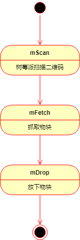

# 工训赛软件工程分析

## 碎碎念

之前参加工训赛其实是抱着想要把这个比赛打完的想法的，但是中途突然收到了老师的通知得知比赛实际的举办时间已经推迟到了12月，对于我们队伍中的三个人来说都是一个噩耗，所以无奈只好放弃了这个比赛。

我们之前的项目给到了学弟手中，由我经手的代码也已经悉数开源到[这里](https://gitee.com/zhewana/2023-Work-training-competition-software)了，希望学弟带着我的遗志（bushi）继续努力下去！

工训赛的工程其实是笔者写的相对比较认真的工程，有些地方略显青涩，但是值得一说（吧？）。再加上笔者自己也恰好有需要分析这个项目的需求，遂写了这篇文章。

不足之处，敬请斧正。

## 软硬件平台

控制器：STM32H750VBT6

开发环境：使用Clion作为编辑器，使用AC6工具链进行编译

## 代码结构与分析

这个工程和以往的工程最大的不同其实是笔者**有认真的思考过整个代码的软件架构应该如何进行组织**，包括但不限于：

* 硬件接口应该如何定义
* 软硬件应该如何分离
* RTOS和中断应该如何进行权衡
* ......

上述问题笔者可能会在接下来的内容中展开说明，也可能不会（毕竟有些东西逼着自己也不清楚应该如何表达），但是笔者会尽量把整个工程讲述清楚。

先来看一张大概的结构图：


这个结构图大致描述了整个控制器工程的代码架构，笔者将其整体分为四层：**应用层（1）->框架层（2）->驱动层（3）->硬件层（4）**

这个分层只是笔者自己当前阶段认为的分层方式，可能并不完善，甚至包含错误，**仅作参考**。

虽然在整个结构图中并没有体现和RTOS相关的内容，但是笔者的的确确将RTOS融入到了应用层和框架层的组织中。这部分我们后面详叙。

### 应用层代码

严格来讲，工训赛这个工程并不算是一个产品而是一套自动化的流程，所以其实会缺少一些产品才会有的属性，比如：良好的人机交互系统。

但是在实际使用中为了方便调试，笔者还是引入了[LetterShell](https://github.com/NevermindZZT/letter-shell)这样的命令行交互系统来进行参数的调节和一些选项的设置。并且由于shell操作和自动化运行其实是完全互相独立的关系，所以可以在架构图中看到：LetterShell提供的方法和实际的业务代码是同处应用层中的两个不同部分，他们直接面向用户（需求），实现最终的功能。

**显而易见的：应用层代码是随需求变化而变化的。**

#### 自动化运行相关代码

最典型的应用层的代码集合应该是 `static void __RunMainState(void)----utils.c:55`

> PS：笔者在此处以及后文将会使用类似的语法：`行代码----文件名:行数`来导航到一些过长不便展示的函数或代码。

这个函数实际是一个状态机的实现，用来描述整车的状态流程：



尽管实际上整车的状态流程就是一个简单的线性流程，完全可以直接在函数中直接执行，但是笔者还是使用了状态机来进行组织，以应付后续可能会出现的更加复杂的需求。

该状态机运行在由FreeRTOS所调度的一个任务中 `void StateMachineEntry(void *argument)----freertos.c:281`：

```C
void StateMachineEntry(void *argument) {
    /* USER CODE BEGIN StateMachineEntry */
    UNUSED(argument);
    /* Infinite loop */
    for (;;) {
        if (CarInfo.Start_State) {
            CarInfo.RunMainState();
        }
    }
    /* USER CODE END StateMachineEntry */
}
```

启动状态机调度的标志位由一个按键通过按键框架进行控制，以实现按下按键就能开始自动运行的功能。

#### LetterShell API相关代码

LetterShell中只实现了调试用得到的6个指令：

|                              指令                              |          功能          |
| :-------------------------------------------------------------: | :--------------------: |
|                 set`<paraname paravalue>`...                 |  设置paraname参数的值  |
| motormove`<axis-y-value>` `<axis-y-value>` `<speedlimit>` | 基于车体坐标系进行移动 |
|  mapmove`<axis-y-value>` `<axis-y-value>` `<speedlimit>`  | 基于世界坐标系进行移动 |
|                         rota `<dig>`                         |        旋转车身        |
|                               ed                               |    关闭串口数据输出    |
|                               op                               |    打开串口数据输出    |

#### 接口相关代码

应用层实现所用的接口实际大致可以分为两种：**框架层接口**和**驱动层接口**

其中驱动层接口一般用于比较简单的硬件设备的驱动，例如总线舵机相关的代码 `utils.c:304`：

```C
/**
 * @brief 夹子电机旋转(夹子开关)
 * @param position 舵机位置单位(0-1000)
 * @param time 运行所需时间(单位:ms)
 */
void ClipRotition(float position, uint32_t time) {
    LobotSerialServoMove(ClipServoID, (int16_t) position, time);
}

void ClipCloseForOS(void) {
    ClipRotition(CLIP_CLOSE, 700);
}

void ClipOpenForOS(void) {
    ClipRotition(CLIP_OPEN, 700);
}
```

而框架层的接口则是由框架层直接提供出来用来操控整车运动的，我们在下一节详叙。

### 框架层代码
